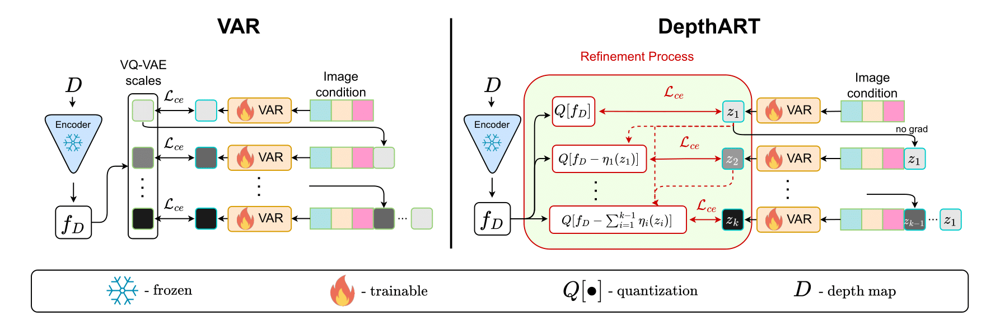

# DepthART: Monocular Depth Estimation as Autoregressive Refinement Task
Bulat Gabdullin, Nina Konovalova, Nikolay Patakin, Dmitry Senushkin, Anton Konushin
## [Arxiv](https://arxiv.org/abs/2409.15010) | [Project Page](https://bulatko.github.io/depthart-pp/)



## Installation
install python and requirements:
```bash
git clone https://github.com/AIRI-Institute/DepthART
cd DepthART
conda create -n depthART python=3.10.14
conda activate depthART
pip install -r requirements.txt
```


## Datasets

### Hypersim
```
hypersim/
├── final_train_split.csv
├── final_val_split.csv
└── scenes/
├── scene_001/
│ ├── images/
│ │ ├── image_0001.jpg
│ │ ├── image_0002.jpg
│ │ └── ...
│ └── depth/
│ ├── depth_0001.h5
│ ├── depth_0002.h5
│ └── ...
├── scene_002/
│ ├── images/
│ └── depth/
└── ...
```


### ETH3D
```
eth3d/
├── samples_test.pth
├── samples_train.pth
└── data/
    ├── images/
    │   ├── image_0001.png
    │   ├── image_0002.png
    │   └── ...
    └── depth/
        ├── depth_0001.png
        ├── depth_0002.png
        └── ...
```
The root folder eth3d/ contains:
 - samples_test.pth: file with sample information for the test set.
 - samples_train.pth: file with sample information for the training set (if available).


The data/ subfolder contains:
 - images/: folder with original images in PNG format.
 - depth/: folder with corresponding depth maps in PNG format.


### IBIMS

```
ibims1/
├── imagelist.txt
├── rgb/
│   ├── image_0001.png
│   ├── image_0002.png
│   └── ...
├── depth/
│   ├── image_0001.png
│   ├── image_0002.png
│   └── ...
├── mask_invalid/
│   ├── image_0001.png
│   ├── image_0002.png
│   └── ...
├── mask_transp/
│   ├── image_0001.png
│   ├── image_0002.png
│   └── ...
├── calib/
│   ├── image_0001.txt
│   ├── image_0002.txt
│   └── ...
├── edges/
│   ├── image_0001.png
│   ├── image_0002.png
│   └── ...
├── mask_table/
│   ├── image_0001.png
│   ├── image_0001.txt
│   ├── image_0002.png
│   ├── image_0002.txt
│   └── ...
├── mask_floor/
│   ├── image_0001.png
│   ├── image_0001.txt
│   ├── image_0002.png
│   ├── image_0002.txt
│   └── ...
└── mask_wall/
    ├── image_0001.png
    ├── image_0001.txt
    ├── image_0002.png
    ├── image_0002.txt
    └── ...
```

### NYUv2
```
nyuv2/
├── data/
│   ├── nyuv2_test.pkl
│   ├── nyuv2_train.pkl
│   ├── raw_depth_test.pkl
│   ├── raw_depth_train.pkl
│   └── samples_test_0_01.pth
├── images/
│   ├── image_0001.jpg
│   ├── image_0002.jpg
│   └── ...
└── depth/
    ├── depth_0001.pkl
    ├── depth_0002.pkl
    └── ...
```

### TUM
```
tum/
├── data/
│   ├── sample_0001.h5
│   ├── sample_0002.h5
│   └── ...
├── samples_test.pth
├── samples_train.pth (if available)
└── samples_val.pth (if available)
```


The data/ directory contains:
  - HDF5 files (.h5) for each sample in the dataset. Each file contains:
    - An 'image' data: RGB image data
    - A 'depth' data: Corresponding depth map


## Evaluation
1. Download datasets and set `<DATASET>_PATH` at [config/environment.yaml](config/environment.yaml) to your dataset paths.
2. To remove dataset from evaluation, comment out the dataset at [core/datasets/eval/all.yaml](config/core/datasets/eval/all.yaml)
3. To evaluate DepthART, load checkpoint [model.safetensors](https://drive.google.com/file/d/11-G5lpT9OM0LQRoczW0Hb15akX300wpG/view?usp=sharing). Then set `model.model.ckpt_path` to `PATH_TO_CHECKPOINT/model.safetensors` in 
[depthART.yaml](depthart/depth-estimation/config/launch/eval/depthART.yaml) to point to the checkpoint.
then run:
```bash
python tools/eval.py --config-name=eval_depthART.yaml
```

## Training
1. Download Hypersim dataset, and set `HYPERSIM_PATH` at [config/environment.yaml](config/environment.yaml) to your dataset path. Also download [final_train_split.csv](final_train_split.csv) and [final_val_split.csv](final_val_split.csv) and put them in your dataset directory.
2. Download [VQ-VAE](https://huggingface.co/FoundationVision/var/resolve/main/vae_ch160v4096z32.pth) and [VAR](https://huggingface.co/FoundationVision/var/resolve/main/var_d16.pth) checkpoints and put them in `./vae_ch160v4096z32.pth` and `./var_d16.pth` respectively.
3. Run training:
```bash
bash tools/dist_train.sh train_depthART.yaml
```

## Citation
If you find this work useful for your research, please cite our paper:

```bibtex
@article{gabdullin2024depthart,
  title={DepthART: Monocular Depth Estimation as Autoregressive Refinement Task},
  author={Gabdullin, Bulat and Konovalova, Nina and Patakin, Nikolay and Senushkin, Dmitry and Konushin, Anton},
  journal={arXiv preprint arXiv:2409.15010},
  year={2024}
}
```